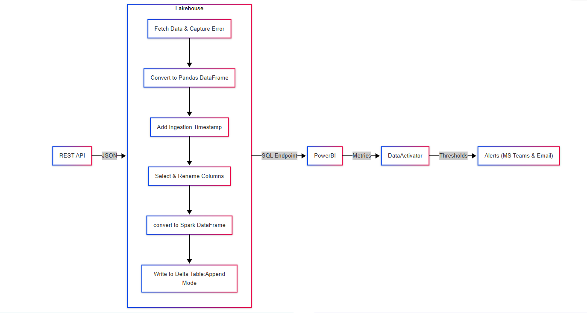

# Crypto Price Spike Alerting System 

A real-time cryptocurrency monitoring solution built using **Microsoft Fabric**, **Power BI**, and **Data Activator**. This project ingests live data from the CoinGecko API, analyzes trends and spikes in coin prices, and sends alerts when price surges occur.

---

## Project Overview
Cryptocurrency prices are highly volatile. This project monitors top coins and triggers alerts when any experience a **significant 24-hour spike**, allowing users to react quickly to market movements.

---

## What This Project Does

- Ingests real-time coin data using CoinGecko API
- Stores and updates a Delta table in Microsoft Fabric Lakehouse
- Transforms and cleanses data using PySpark
- Visualizes key metrics and price trends in Power BI
- Uses Microsoft Data Activator to trigger Teams/email alerts

---

## 📆 Tools & Technologies Used
- Microsoft Fabric (Lakehouse + Notebooks)
- Power BI (DirectLake + Card visuals + KPI layout)
- PySpark (data ingestion & transformation)
- Microsoft Data Activator (Reflex alerts)
- Microsoft Teams (for alerts)

---

## Architecture


## Data Pipeline


---

## Dashboard Features

### 1. KPI Row
- **Alert on High Spike**: Shows coin with the highest % spike
- **Formatted Change**: +% or -% in last 24 hours
- **Current Price**: Live price
- **Market Cap**: Billion/T format
- **Previous Price**: Prior data point
- **High Spike Coin Summary**: e.g., `testcoin: +18%`

### 2. Price Trends Over Time (Line Chart)
- Shows historical price trend per coin
- Logarithmic Y-axis for clarity across wide price ranges

### 3. Current Prices & Changes (Table)
- All top tracked coins
- Current price, 24h change, % change
- Timestamped rows for trend analysis

---

## Data Ingestion Pipeline

> 📑 **Note**: No separate "Pipeline" was created — instead, a **scheduled PySpark Notebook** acts as the full ingestion + transformation pipeline.

- Scheduled every 10–15 mins
- Fetches from API
- Transforms into Delta Lake table `coin_price_data`
- Handles nulls, time columns, and optional test inserts

---

## Data Model

```text
coin_price_data (Delta Table)
- coin_id
- symbol
- name
- current_price
- market_cap
- price_change_24h
- price_change_percentage_24h
- ingestion_timestamp
```

---

## Data Activator Setup

- Visual trigger: Power BI visual (e.g., Table or KPI)
- Trigger rule: `price_change_percentage_24h > 10`
- Action: Sends Teams or email alert with coin name, value, timestamp

Example Message:
```text
🚨 testcoin has spiked by 18.0% in the last 24h.
Current Price: $95,534
Time: 2025-04-29 10:41 AM
```
